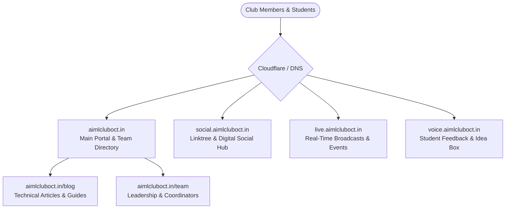

# 🌐 AIML Club OCT Digital Ecosystem & Voice Portal

> Scalable cloud and web architecture powering the digital infrastructure of **AIML Club – Oriental College of Technology, Bhopal**.

---

## 📌 Architecture Overview

The digital presence of AIML Club OCT is designed as a distributed, high-availability ecosystem comprising specialized subdomains and service portals:

---

## 🚀 Ecosystem Portals

| Subdomain | Function | Tech Stack | Status |
| :--- | :--- | :--- | :---: |
| [**aimlcluboct.in**](https://aimlcluboct.in) | Primary website: Club overview, team catalog, workshops, resources | Next.js, React, Tailwind CSS | 🟢 Live |
| [**social.aimlcluboct.in**](https://social.aimlcluboct.in) | Consolidated link hub: Social networks, community links | Modern Responsive Web | 🟢 Live |
| [**live.aimlcluboct.in**](https://live.aimlcluboct.in) | Real-time event broadcasting and live results | Real-time dashboard | 🟢 Live |
| [**voice.aimlcluboct.in**](https://voice.aimlcluboct.in) | Interactive suggestions and anonymous feedback portal | Form API + Database | 🟢 Live |

---

## 👥 Lead Architect
- **Umesh Patel** ([@UmeshCode1](https://github.com/UmeshCode1)) — Vice President & System Architect, AIML Club OCT.
