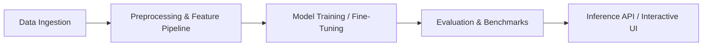

# [Project Name]

> [One-line summary of the problem and technical solution]

[](#)
[](#)
[](#)

---

## 🎯 Problem Statement
[Clearly describe the real-world challenge this project aims to solve.]

## 💡 Solution Architecture
[Explain the machine learning, deep learning, computer vision, or NLP approach used to address the problem.]



## 📊 Dataset
- **Source:** [URL to public dataset or description]
- **Attributes / Features:** [Summary of inputs and target labels]
- **Data License:** [e.g. MIT, CC-BY 4.0]

## 🛠️ Tech Stack & Requirements
- **Language:** Python 3.10+
- **Key Libraries:** `numpy`, `pandas`, `scikit-learn`, `torch`
- **Serving / UI:** `fastapi` or `streamlit`

## 🚀 Getting Started

```bash
# 1. Clone the repository
git clone https://github.com/AIMLCLUBOCT/Projects.git
cd Projects/[level]/[project-name]

# 2. Setup virtual environment
python -m venv .venv
source .venv/bin/activate  # On Windows: .venv\Scripts\Activate.ps1

# 3. Install dependencies
pip install -r requirements.txt

# 4. Run training or inference demo
python src/main.py
```

## 📈 Results & Evaluation
| Metric | Baseline | Final Model |
| :--- | :--- | :--- |
| **Accuracy / $R^2$** | -- | -- |
| **Precision / Recall** | -- | -- |

## 👥 Contributors & Maintainers
- **Author / Lead:** [Name / GitHub Handle]
- **Club:** AIML Club – Oriental College of Technology, Bhopal
